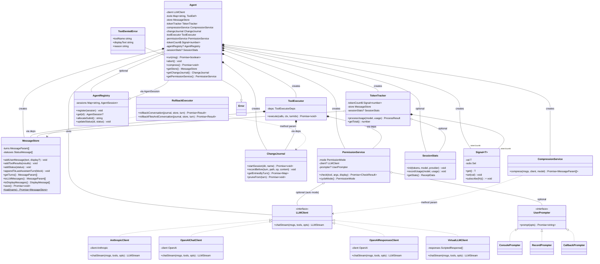

# Class Diagram

```mermaid
classDiagram

    %% ── Core ──
    class Agent {
        -client LLMClient
        -tools Map~string, ToolDef~
        -store MessageStore
        -tokenTracker TokenTracker
        -compressionService CompressionService
        -changeJournal ChangeJournal
        -toolExecutor ToolExecutor
        -permissionService PermissionService
        -tokenCount$ Signal~number~
        -agentRegistry? AgentRegistry
        -sessionStats? SessionStats
        +run(msg) Promise~boolean~
        +abort() void
        +compress() Promise~void~
        +getStore() MessageStore
        +getChangeJournal() ChangeJournal
        +getPermissionService() PermissionService
    }

    class MessageStore {
        -turns MessageParam[]
        -statuses StatusMessage[]
        +addUserMessage(text, display?) void
        +addToolResults(results) void
        +addStatus(status) void
        +appendToLastAssistantTurn(block) void
        +getTurns() MessageParam[]
        +toLLMMessages() MessageParam[]
        +toDisplayMessages() DisplayMessage[]
        +save() Promise~void~
        +load(name)$ Promise~MessageStore~
    }

    class ToolExecutor {
        -deps: ToolExecutorDeps
        +execute(calls, ctx, turnIdx) Promise~void~
    }

    %% ── Services ──
    class PermissionService {
        -mode PermissionMode
        -client? LLMClient
        -prompter? UserPrompter
        +check(tool, args, display) Promise~CheckResult~
        +cycleMode() PermissionMode
    }

    class ChangeJournal {
        +startSession(dir, name) Promise~void~
        +recordBefore(turn, path, op, content) void
        +getEntriesByTurn() Promise~Map~
        +pruneFrom(turn) Promise~void~
    }

    class TokenTracker {
        -tokenCount$ Signal~number~
        -store MessageStore
        -sessionStats? SessionStats
        +processUsage(model, usage) ProcessResult
        +getTotal() number
    }

    class CompressionService {
        +compress(msgs, client, model) Promise~MessageParam[]~
    }

    class SessionStats {
        +init(tokens, model, provider) void
        +recordUsage(model, usage) void
        +getStats() ReceiptData
    }

    class AgentRegistry {
        -sessions Map~string, AgentSession~
        +register(session) void
        +get(id) AgentSession?
        +allocateSubId() string
        +updateStatus(id, status) void
    }

    class RollbackExecutor {
        +rollbackConversation(journal, store, turn) Promise~Result~
        +rollbackFilesAndConversation(journal, store, turn) Promise~Result~
    }

    %% ── LLM ──
    class LLMClient {
        <<interface>>
        +chatStream(msgs, tools, opts) LLMStream
    }

    class AnthropicClient {
        -client Anthropic
        +chatStream(msgs, tools, opts) LLMStream
    }

    class OpenAIChatClient {
        -client OpenAI
        +chatStream(msgs, tools, opts) LLMStream
    }

    class OpenAIResponsesClient {
        -client OpenAI
        +chatStream(msgs, tools, opts) LLMStream
    }

    class VirtualLLMClient {
        -responses ScriptedResponse[]
        +chatStream(msgs, tools, opts) LLMStream
    }

    %% ── Utils ──
    class Signal~T~ {
        -val T
        -subs Set
        +get() T
        +set(val) void
        +subscribe(fn) () = void
    }

    class UserPrompter {
        <<interface>>
        +prompt(opts) Promise~string~
    }

    class ConsolePrompter
    class RecordPrompter
    class CallbackPrompter

    %% ── Error ──
    class ToolDeniedError {
        +toolName string
        +displayText string
        +reason string
    }

    %% ── Relationships ──

    Agent *-- MessageStore : creates
    Agent *-- TokenTracker : creates
    Agent *-- CompressionService : creates
    Agent *-- ChangeJournal : creates
    Agent *-- ToolExecutor : creates
    Agent *-- PermissionService : creates
    Agent *-- "tokenCount$" Signal~number~ : creates

    Agent o-- LLMClient : uses
    Agent o-- AgentRegistry : optional
    Agent o-- SessionStats : optional

    ToolExecutor *-- PermissionService : via deps
    ToolExecutor *-- ChangeJournal : via deps
    ToolExecutor *-- MessageStore : via deps

    TokenTracker *-- "tokenCount$" Signal~number~
    TokenTracker o-- MessageStore
    TokenTracker o-- SessionStats : optional

    PermissionService o-- LLMClient : optional (auto mode)
    PermissionService o-- UserPrompter : optional

    AgentRegistry o-- Agent : via AgentSession

    RollbackExecutor ..> ChangeJournal : method param
    RollbackExecutor ..> MessageStore : method param
    CompressionService ..> LLMClient : method param

    LLMClient <|.. AnthropicClient
    LLMClient <|.. OpenAIChatClient
    LLMClient <|.. OpenAIResponsesClient
    LLMClient <|.. VirtualLLMClient

    UserPrompter <|.. ConsolePrompter
    UserPrompter <|.. RecordPrompter
    UserPrompter <|.. CallbackPrompter

    ToolDeniedError --|> Error
```
